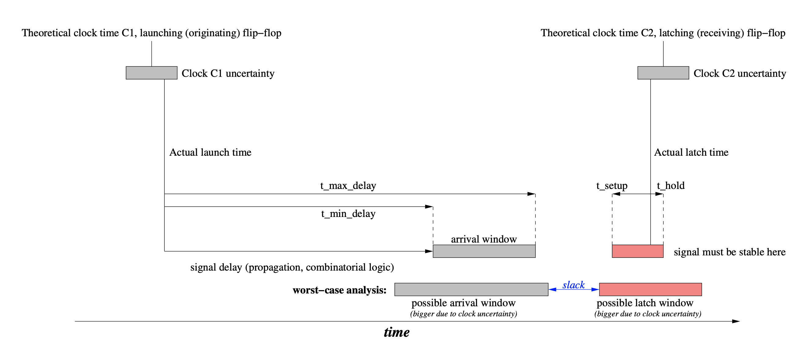

Timing Closure
==============

This repository contains tools and documents to understand timing closure in FPGA design.

The end goal is to have a set of rules, guidelines, and best practices for properly
annotating an FPGA design with SDC-style constraints that help the compiler toolchain
and its user to achieve timing closure.

Interesting info on the web
===========================

Static Timing Analysis — Wikipedia
----------------------------------

A concise introduction to the subject.

* https://en.wikipedia.org/wiki/Static_timing_analysis

AMD (Xilinx) documentation
--------------------------

Xilinx has a bunch of documents covering timing and timing closure. I feel they are quite unfriendly
to the beginner, since they assume the reader already knows a lot, and the basics are not
properly explained.

* https://docs.amd.com/v/u/en-US/dh0006-vivado-design-analysis-and-timing-closure-hub
* https://docs.amd.com/r/en-US/ug949-vivado-design-methodology/Timing-Closure
* https://docs.amd.com/r/en-US/ug938-vivado-design-analysis-closure-tutorial/Tutorial-Overview
* https://docs.amd.com/r/en-US/ug906-vivado-design-analysis/Vivado-NoC-QoS-Reporting-Examples

FPGAs with VHDL: first steps — by Helen DeBlumont
-------------------------------------------------

Focuses on Vivado. Has a few sections on timing that are useful.

* https://github.com/sy2002/MiSTer2MEGA65/blob/master/doc/wiki/assets/FPGAs_VHDL_First_Steps_v2p3.pdf

TimeQuest User Guide — by Ryan Scoville
---------------------------------------

This document focuses on Altera's TimeQuest tool, but is also generally useful.

* http://web02.gonzaga.edu/faculty/talarico/CP430/LEC/TimeQuest_User_Guide.pdf

Clock Domain Crossing (CDC) Design & Verification Techniques Using SystemVerilog — by Clifford E. Cummings
----------------------------------------------------------------------------------------------------------

Focuses on the topic of clock domain crossings.

* https://www.sunburst-design.com/papers/CummingsSNUG2008Boston_CDC.pdf

Books
=====

Static Timing Analysis for Nanometer Designs — by J. Bhasker, Rakesh Chadha
---------------------------------------------------------------------------

Aimed mostly at ASIC design, but the first chapters provide a useful exposition
of the ideas behind Static Timing Analysis.

* https://www.amazon.com/Static-Timing-Analysis-Nanometer-Designs/dp/1441947159

Constraining Designs for Synthesis and Timing Analysis: A Practical Guide to Synopsis Design Constraints (SDC) — by Sridhar Gangadharan and Sanjay Churiwala
-----------------------------------------------------------------------------------------------------------------------------------------------------------------------

* https://www.amazon.com/Constraining-Designs-Synthesis-Timing-Analysis/dp/1461432685

More info
=========

